# AI Discovery Wizard Fullstack Architecture Document

## Introduction

This document outlines the complete fullstack architecture for the **AI Discovery Wizard**, including backend systems, frontend implementation, and their integration. It serves as the single source of truth for AI-driven development, ensuring consistency across the entire technology stack.

This unified approach combines what would traditionally be separate backend and frontend architecture documents, streamlining the development process for modern fullstack applications where these concerns are increasingly intertwined.

### Starter Template or Existing Project

**Decision: N/A - Greenfield project**

Based on the PRD analysis, this is a **greenfield project** with specific technical preferences indicated.

**Recommendation - Modern Fullstack Starter Templates**:

Given your requirements (React/TypeScript frontend, Node.js backend, monorepo structure, serverless-ready), I recommend considering:

1. **T3 Stack** (Next.js + tRPC + Tailwind + TypeScript)
   - ✅ Perfect for full-stack TypeScript, end-to-end type safety
   - ✅ tRPC eliminates REST boilerplate, great for rapid iteration
   - ✅ Next.js handles SEO needs (landing page discoverability)
   - ⚠️ May be overkill if SEO isn't critical

2. **Next.js + Supabase Starter** (RECOMMENDED)
   - ✅ All-in-one: Database, Auth, Storage, Edge Functions
   - ✅ Generous free tier, excellent for MVP cost targets ($20-50/month)
   - ✅ Real-time subscriptions for session auto-save
   - ✅ Many official starters available

3. **Vite + Express + TypeScript (Custom Monorepo)**
   - ✅ Maximum flexibility and simplicity
   - ✅ Faster dev experience than Next.js
   - ⚠️ Requires more setup, no SEO optimization out of box

**My Recommendation**: **Next.js 14 (App Router) + Supabase** for this project because:

- Landing page SEO is valuable for organic discovery
- Supabase dramatically reduces integration overhead (PostgreSQL + Auth + Storage + Edge Functions in one service)
- Next.js Server Components + Server Actions eliminate much of the API boilerplate
- Vercel deployment is trivial (the PRD mentions Vercel as preferred hosting)
- Stays within cost budget and serverless-ready

### Change Log

| Date       | Version | Description                            | Author              |
| ---------- | ------- | -------------------------------------- | ------------------- |
| 2025-10-15 | 1.0     | Initial architecture document creation | Winston (Architect) |

---

## High Level Architecture

### Technical Summary

The AI Discovery Wizard employs a **serverless-first, monolithic fullstack architecture** built on Next.js 14 (App Router) with Supabase as the unified backend platform. The system follows a **progressive enhancement pattern**: a statically-generated landing page transitions to a dynamic, session-driven wizard application that persists state to PostgreSQL and leverages Anthropic's Claude Sonnet for intelligent discovery.

The architecture prioritizes **cost optimization** (targeting $20-100/month at MVP scale), **rapid development velocity** (6-8 week timeline), and **serverless scalability** (auto-scaling from 0 to 100+ concurrent sessions). Frontend components communicate with Next.js Server Actions and API Routes, which orchestrate LLM calls, database operations, and third-party integrations (email, calendar, PDF generation). Session state is persisted to Supabase PostgreSQL with real-time subscriptions enabling auto-save and cross-device handoff.

The **reverse discovery UX pattern** is central to the architecture: users answer 5-8 contextual questions, triggering AI analysis that recommends 3-7 tailored automations displayed in an interactive workflow sketcher with real-time pricing calculations. The experience culminates in PDF report generation and calendar booking integration, converting wizard completions into qualified sales leads.

This architecture achieves PRD goals by: (1) delivering sub-2-second page loads through static generation and code splitting, (2) maintaining <3-second LLM response times via streaming, (3) providing transparent real-time pricing through client-side calculations, (4) ensuring 95%+ uptime via Vercel's edge network, and (5) supporting seamless mobile-desktop handoff through session persistence.

### Platform and Infrastructure Choice

**Platform**: Vercel (Frontend/Edge) + Supabase (Backend/Database)

**Key Services**:

- **Vercel Edge Network**: Static site hosting, serverless functions, automatic scaling, preview deployments
- **Supabase PostgreSQL**: Session storage, discovery documents, automation templates
- **Supabase Edge Functions**: Lightweight serverless compute (Deno runtime) for background tasks
- **Supabase Realtime**: WebSocket subscriptions for session auto-save
- **Cloudflare**: CDN and DDoS protection (free tier)
- **Anthropic API**: Claude Sonnet 3.5 for AI recommendations

**Deployment Host and Regions**:

- **Primary**: Vercel Edge Network (global CDN, 40+ regions)
- **Database**: Supabase US-East-1 (expandable to multi-region post-MVP)
- **Fallback**: Railway or Render for custom backend services if needed

**Decision Rationale**: Vercel + Supabase hits the sweet spot for MVP: generous free tiers ($0-20/month initially), excellent developer experience, automatic scaling, and production-grade reliability (99.9% uptime SLA).

### Repository Structure

**Structure**: Monorepo (single repository, multiple workspaces)

**Monorepo Tool**: npm workspaces (built-in, zero config) or pnpm workspaces (faster, better disk usage)

**Package Organization**:

```
ai-discovery-wizard/
├── apps/
│   └── web/              # Next.js 14 app (frontend + API routes)
├── packages/
│   ├── shared/           # TypeScript types, constants, utilities
│   ├── ui/               # Reusable UI components (shadcn/ui components)
│   └── database/         # Supabase schema, migrations, types
├── docs/                 # Architecture, PRD, runbooks
├── scripts/              # Build, deployment, seed data scripts
└── infrastructure/       # IaC (if needed for custom services)
```

**Rationale**:

- **Monorepo over polyrepo**: Single source of truth, atomic commits, shared dependencies, simpler CI/CD
- **Minimal packages**: Start lean with 3 packages (shared, ui, database), expand only if complexity demands
- **Single Next.js app**: Combines frontend and API routes in one deployable unit, maximizing simplicity

### High Level Architecture Diagram

```mermaid
graph TB
    User[👤 User Browser]
    CDN[Cloudflare CDN]
    Vercel[Vercel Edge Network]
    NextJS[Next.js App<br/>Static + SSR Pages]
    API[Next.js API Routes<br/>Server Actions]
    Claude[Anthropic Claude API]
    Supabase[(Supabase Platform)]
    PSQL[(PostgreSQL Database)]
    Realtime[Realtime WebSocket]
    Edge[Edge Functions]
    Email[Resend Email API]
    Cal[Cal.com Calendar API]
    PDF[PDF Generator<br/>React-PDF]

    User -->|HTTPS| CDN
    CDN -->|Global Edge| Vercel
    Vercel --> NextJS
    NextJS -->|User Actions| API
    API -->|AI Recommendations| Claude
    API -->|CRUD Operations| Supabase
    Supabase --> PSQL
    Supabase --> Realtime
    Supabase --> Edge
    API -->|Generate PDF| PDF
    API -->|Send Email| Email
    API -->|Book Meeting| Cal
    NextJS -.->|Auto-save| Realtime
    Realtime -.->|Session State| PSQL

    style User fill:#e1f5ff
    style Vercel fill:#000
    style Supabase fill:#3ecf8e
    style Claude fill:#d4a574
```



### Architectural Patterns

- **Jamstack Architecture**: Static-first with dynamic enhancements - _Rationale:_ Landing page SEO, instant loads, edge caching while maintaining dynamic wizard interactivity

- **Server Components + Client Islands**: Next.js App Router pattern - _Rationale:_ Minimize client JavaScript, server-render where possible, hydrate only interactive components

- **Backend for Frontend (BFF)**: Next.js API Routes serve as dedicated backend for web app - _Rationale:_ Co-located with frontend, simplified deployment, no CORS complexity, automatic API routing

- **Stateless Serverless Functions**: All API routes are stateless, session state in database - _Rationale:_ Auto-scaling, cost efficiency (pay per request), no server management

- **Event-Driven Background Jobs**: Supabase Edge Functions for async tasks (email, cleanup) - _Rationale:_ Non-blocking user experience, cost-effective async processing

- **Optimistic UI Updates**: Client-side state updates before server confirmation - _Rationale:_ Instant feedback for pricing calculations, add/remove automations feels responsive

- **Repository Pattern**: Data access abstracted through service layer - _Rationale:_ Testability, potential database migration flexibility, cleaner API routes

- **Adapter Pattern**: External integrations wrapped in adapters (email, calendar, LLM) - _Rationale:_ Easy provider swapping, consistent error handling, simplified testing

---

## Tech Stack

This is the **definitive technology selection** for the entire project. All development must use these exact technologies and versions.

### Technology Stack Table

| Category                 | Technology                          | Version              | Purpose                              | Rationale                                                                                              |
| ------------------------ | ----------------------------------- | -------------------- | ------------------------------------ | ------------------------------------------------------------------------------------------------------ |
| **Frontend Language**    | TypeScript                          | 5.3+                 | Type-safe frontend development       | Catch errors at compile time, better IDE support, self-documenting code                                |
| **Frontend Framework**   | Next.js (App Router)                | 14.1+                | Full-stack React framework           | Server components, built-in API routes, optimized bundling, Vercel deployment, SEO support             |
| **UI Component Library** | shadcn/ui + Radix UI                | Latest               | Accessible, customizable components  | Unstyled primitives (Radix), copy-paste components (shadcn), WCAG AA compliant out of box              |
| **State Management**     | React Context + Zustand             | Zustand 4.5+         | Client state management              | Context for simple state, Zustand for complex global state (pricing, session), avoids Redux complexity |
| **Backend Language**     | TypeScript (Node.js)                | Node 20 LTS          | Server-side logic                    | Code sharing with frontend, consistent tooling, strong ecosystem                                       |
| **Backend Framework**    | Next.js API Routes + Server Actions | 14.1+                | Backend API layer                    | Co-located with frontend, zero CORS config, streaming support, edge-ready                              |
| **API Style**            | REST + Server Actions               | Next.js 14           | Client-server communication          | Server Actions for mutations, REST for public APIs, simpler than GraphQL for MVP                       |
| **Database**             | PostgreSQL (via Supabase)           | 15+                  | Primary data store                   | Relational data (sessions, documents), JSONB for flexible fields, proven reliability                   |
| **Cache**                | Supabase Edge Cache + React Cache   | Native               | Response caching, query optimization | Built-in edge caching, React cache() for request deduplication                                         |
| **File Storage**         | Supabase Storage                    | Native               | PDF storage (temporary)              | Integrated with PostgreSQL RLS, automatic cleanup policies                                             |
| **Authentication**       | None (MVP)                          | N/A                  | Anonymous sessions                   | No auth needed for wizard, session-based tracking sufficient                                           |
| **Frontend Testing**     | Vitest + Testing Library            | Vitest 1.2+, RTL 14+ | Component and unit tests             | Fast (Vite-powered), compatible with Jest, better DX than Jest                                         |
| **Backend Testing**      | Vitest                              | 1.2+                 | API and integration tests            | Same test runner as frontend, TypeScript native, fast execution                                        |
| **E2E Testing**          | Manual (MVP)                        | N/A                  | End-to-end user flows                | Defer Playwright until post-MVP, manual testing sufficient for launch                                  |
| **Build Tool**           | Next.js built-in                    | 14.1+                | Application bundling                 | Turbopack (dev), webpack (prod), zero config, optimized for React                                      |
| **Bundler**              | Turbopack / Webpack                 | Next.js default      | Module bundling                      | Next.js handles bundler selection, Turbopack for dev speed                                             |
| **IaC Tool**             | None (MVP)                          | N/A                  | Infrastructure management            | Vercel + Supabase are managed platforms, no IaC needed initially                                       |
| **CI/CD**                | GitHub Actions                      | Latest               | Automated testing and deployment     | Free for public repos, Vercel integration, simple YAML config                                          |
| **Monitoring**           | Sentry                              | Latest               | Error tracking and performance       | Free tier (5K events/month), rich context, source maps support                                         |
| **Logging**              | Vercel Logs + Supabase Logs         | Native               | Application logging                  | Built-in structured logging, no external service needed for MVP                                        |
| **CSS Framework**        | Tailwind CSS                        | 3.4+                 | Utility-first styling                | Rapid UI development, consistent design system, excellent VS Code support                              |

---

## Data Models

Based on the PRD requirements, the following are the core business entities shared between frontend and backend.

### Session

**Purpose:** Tracks user wizard sessions, enables auto-save, browser refresh recovery, and device handoff

**Key Attributes:**

- `id`: string (UUID v4) - Unique session identifier
- `createdAt`: Date - Session creation timestamp
- `updatedAt`: Date - Last activity timestamp
- `expiresAt`: Date - Session expiration (7 days from last activity)
- `currentStep`: string - Current wizard step identifier
- `answers`: Record<string, any> - User responses to questions
- `selectedAutomations`: string[] - Array of automation IDs selected by user
- `pricingData`: PricingBreakdown | null - Calculated pricing information
- `deviceType`: 'mobile' | 'tablet' | 'desktop' - Original device type
- `userAgent`: string - Browser user agent
- `ipAddress`: string | null - User IP (for rate limiting, anonymized)
- `status`: 'active' | 'completed' | 'abandoned' - Session lifecycle status

#### TypeScript Interface

```typescript
interface Session {
  id: string;
  createdAt: Date;
  updatedAt: Date;
  expiresAt: Date;
  currentStep: WizardStep;
  answers: WizardAnswers;
  selectedAutomations: string[];
  pricingData: PricingBreakdown | null;
  deviceType: DeviceType;
  userAgent: string;
  ipAddress: string | null;
  status: SessionStatus;
}

type WizardStep =
  | 'landing'
  | 'industry'
  | 'team-size'
  | 'pain-points'
  | 'volumes'
  | 'analysis'
  | 'recommendations'
  | 'sketcher'
  | 'summary';
type DeviceType = 'mobile' | 'tablet' | 'desktop';
type SessionStatus = 'active' | 'completed' | 'abandoned';

interface WizardAnswers {
  industry?: 'Legal' | 'Healthcare' | 'RealEstate' | 'Consulting' | 'Other';
  industryOther?: string;
  teamSize?: '1-5' | '6-10' | '11-25' | '26-50' | '50+';
  painPoints?: PainPoint[];
  volumes?: Record<string, number>;
  additionalContext?: string;
}

type PainPoint =
  | 'DocumentProcessing'
  | 'ClientIntake'
  | 'EmailManagement'
  | 'DataEntry'
  | 'Scheduling'
  | 'Other';
```

#### Relationships

- Session **has many** DiscoveryDocuments (usually 1, but supports versioning)
- Session **references many** Automations (via selectedAutomations array)

### Automation

**Purpose:** Catalog of automation templates that can be recommended and selected by users

**Key Attributes:**

- `id`: string (UUID) - Unique automation identifier
- `title`: string - Display name
- `description`: string - 2-3 sentence explanation of capabilities
- `industry`: string[] - Applicable industries
- `category`: string - Workflow category
- `estimatedTimeSavings`: number - Hours saved per month (baseline)
- `tokenEstimate`: number - Estimated monthly token consumption
- `complexity`: 'Low' | 'Medium' | 'High' - Implementation complexity
- `isActive`: boolean - Whether automation is available for selection
- `icon`: string - Icon identifier for UI rendering
- `createdAt`: Date - Record creation timestamp
- `updatedAt`: Date - Last modification timestamp

#### TypeScript Interface

```typescript
interface Automation {
  id: string;
  title: string;
  description: string;
  industry: Industry[];
  category: AutomationCategory;
  estimatedTimeSavings: number;
  tokenEstimate: number;
  complexity: Complexity;
  isActive: boolean;
  icon: string;
  createdAt: Date;
  updatedAt: Date;
}

type Industry =
  | 'Legal'
  | 'Healthcare'
  | 'RealEstate'
  | 'Consulting'
  | 'General';
type AutomationCategory =
  | 'DocumentProcessing'
  | 'Communication'
  | 'DataAnalysis'
  | 'Administrative'
  | 'Research';
type Complexity = 'Low' | 'Medium' | 'High';
```

#### Relationships

- Automation **referenced by many** Sessions (via selectedAutomations)
- Automation **referenced by many** DiscoveryDocuments

### DiscoveryDocument

**Purpose:** Complete capture of user discovery session for vendor follow-up and CRM integration

**Key Attributes:**

- `id`: string (UUID) - Unique document identifier
- `sessionId`: string - Reference to parent session
- `email`: string | null - User email (if provided)
- `industry`: string - User's industry
- `teamSize`: string - Team size category
- `painPoints`: string[] - Identified pain points
- `volumeMetrics`: Record<string, number> - Task volume data
- `suggestedAutomations`: AutomationRecommendation[] - AI-generated recommendations
- `finalAutomations`: string[] - User's final selection
- `pricingData`: PricingBreakdown - Final pricing breakdown
- `timeSavingsData`: TimeSavingsBreakdown - Time savings analysis
- `aiInsights`: string[] - Contextual insights shown during session
- `leadQualityScore`: number - Calculated lead quality (0-100)
- `status`: string - Document status
- `pdfUrl`: string | null - Generated PDF URL (temporary, 24hr)
- `bookingId`: string | null - Calendar booking reference
- `createdAt`: Date - Document creation
- `completedAt`: Date | null - Session completion time

#### TypeScript Interface

```typescript
interface DiscoveryDocument {
  id: string;
  sessionId: string;
  email: string | null;
  industry: string;
  teamSize: string;
  painPoints: string[];
  volumeMetrics: Record<string, number>;
  suggestedAutomations: AutomationRecommendation[];
  finalAutomations: string[];
  pricingData: PricingBreakdown;
  timeSavingsData: TimeSavingsBreakdown;
  aiInsights: string[];
  leadQualityScore: number;
  status: DiscoveryStatus;
  pdfUrl: string | null;
  bookingId: string | null;
  createdAt: Date;
  completedAt: Date | null;
}

interface AutomationRecommendation {
  automationId: string;
  rationale: string;
  priority: number;
}

type DiscoveryStatus =
  | 'draft'
  | 'completed'
  | 'emailed'
  | 'booked'
  | 'contacted';
```

#### Relationships

- DiscoveryDocument **belongs to** Session (many-to-one)
- DiscoveryDocument **references many** Automations

### PricingBreakdown (Shared Type)

**Purpose:** Structured pricing calculation shared across Session and DiscoveryDocument

```typescript
interface PricingBreakdown {
  automations: AutomationPricing[];
  totalMonthlyCost: number;
  totalTokens: number;
  calculatedAt: Date;
}

interface AutomationPricing {
  automationId: string;
  monthlyCost: number;
  estimatedTokens: number;
}
```

### TimeSavingsBreakdown (Shared Type)

**Purpose:** Time savings calculation shared across multiple entities

```typescript
interface TimeSavingsBreakdown {
  automations: AutomationTimeSavings[];
  totalHoursPerMonth: number;
  totalHoursPerWeek: number;
  costPerHourSaved: number;
  calculatedAt: Date;
}

interface AutomationTimeSavings {
  automationId: string;
  hoursPerMonth: number;
  adjustmentFactor: number;
  rationale: string;
}
```

---

## API Specification

The AI Discovery Wizard uses **Next.js Server Actions** for mutations and **REST API Routes** for queries and external integrations.

### API Design Approach

**Primary API Style**: Next.js Server Actions (mutations) + REST API Routes (queries)

**Server Actions** (Preferred for internal operations):

- Type-safe by default (TypeScript inference)
- Automatic serialization/deserialization
- Progressive enhancement support
- Used for: Session updates, automation selection, email capture

**REST API Routes** (For external access):

- Standard HTTP methods (GET, POST, PUT, DELETE)
- JSON request/response format
- Used for: Admin dashboard, webhooks, PDF generation, analytics

### Core API Endpoints

#### Session Management

```typescript
// Server Action
async function createSession(deviceType: DeviceType): Promise<Session>;

async function updateSession(
  sessionId: string,
  updates: Partial<Session>
): Promise<Session>;

// REST
GET / api / sessions / [sessionId];
```

#### AI Recommendations

```typescript
// Server Action with streaming
async function generateRecommendations(
  sessionId: string
): Promise<AutomationRecommendation[]>

// REST
GET /api/automations?industry={industry}&category={category}
```

#### Pricing & Calculations

```typescript
// Server Action
async function calculatePricing(
  automationIds: string[],
  volumeMetrics: Record<string, number>
): Promise<PricingBreakdown>;

async function calculateTimeSavings(
  automationIds: string[],
  volumeMetrics: Record<string, number>
): Promise<TimeSavingsBreakdown>;
```

#### PDF Generation & Email

```
POST /api/pdf/generate
Body: { sessionId: string }
Response: { pdfUrl: string, expiresAt: Date }

// Server Action
async function sendDiscoveryEmail(
  sessionId: string,
  email: string,
  subscribeToNewsletter: boolean
): Promise<{ success: boolean }>
```

#### Calendar Booking

```typescript
// Server Action
async function createBookingIntent(
  sessionId: string
): Promise<{ bookingUrl: string; agenda: string }>;

// Webhook
POST / api / webhooks / booking;
```

#### Discovery Documents (Admin)

```
GET /api/admin/discovery-documents?status={status}&sort={field}
GET /api/admin/discovery-documents/[id]
```

### API Response Format

**Success Response**:

```typescript
{
  success: true,
  data: T,
  timestamp: Date
}
```

**Error Response**:

```typescript
{
  success: false,
  error: {
    code: string,
    message: string,
    details?: Record<string, any>
  },
  timestamp: Date
}
```

### Authentication & Rate Limiting

**Public Endpoints**: No auth (session management, pricing, PDF, email, booking)
**Admin Endpoints**: Basic auth for MVP
**Rate Limiting**: 60 requests/minute per IP (general), 10 AI recommendations/hour per session

---

## Components

This section identifies major logical components/services across the fullstack architecture.

### Frontend Components

#### Wizard Shell

**Responsibility:** Orchestrates wizard flow, manages navigation, progress tracking, and session state persistence
**Key Interfaces:** `WizardProvider`, `useWizardNavigation()`, `ProgressIndicator`
**Dependencies:** SessionService, WizardStepComponents, StorageService
**Technology:** Next.js App Router, React Context, Zustand

#### Question Flow Components

**Responsibility:** Render individual question screens with form controls, validation, adaptive branching
**Key Interfaces:** `QuestionStep<T>`, `IndustrySelector`, `PainPointSelector`, `VolumeMetricsInput`
**Dependencies:** WizardShell, ValidationService, react-hook-form
**Technology:** React Server Components (where possible), shadcn/ui, Tailwind CSS

#### Workflow Sketcher

**Responsibility:** Interactive canvas for viewing, adding, removing, and organizing automations
**Key Interfaces:** `WorkflowCanvas`, `AutomationCard`, `AutomationLibrary`
**Dependencies:** AutomationService, PricingService
**Technology:** Client-side React, Framer Motion

#### Pricing Panel

**Responsibility:** Real-time display of pricing, time savings, ROI calculations
**Key Interfaces:** `PricingPanel`, `PricingBreakdownModal`, `usePricing()`
**Dependencies:** PricingService, TimeSavingsService
**Technology:** Client components with Zustand, React Query

#### Summary & Output Components

**Responsibility:** Professional display of final recommendations, PDF preview, conversion CTAs
**Key Interfaces:** `SummaryScreen`, `BusinessContextSummary`, `ConversionCTAs`
**Dependencies:** DiscoveryDocumentService, PDFService, EmailService
**Technology:** Server Components for initial render, client for CTAs

### Backend Services

#### Session Service

**Responsibility:** CRUD operations for session management, auto-save, expiration, cleanup
**Key Interfaces:** `createSession()`, `getSession()`, `updateSession()`, `deleteExpiredSessions()`
**Dependencies:** Supabase PostgreSQL client, Session model
**Technology:** TypeScript, Supabase JS client, Server Actions

#### AI Recommendation Engine

**Responsibility:** LLM orchestration for generating personalized automation recommendations
**Key Interfaces:** `generateRecommendations()`, `streamRecommendations()`, `buildPrompt()`
**Dependencies:** Claude API client, Automation repository, Prompt templates
**Technology:** Anthropic SDK, TypeScript, Next.js streaming

#### Pricing Service

**Responsibility:** Calculate monthly costs based on automation selections and volume metrics
**Key Interfaces:** `calculatePricing()`, `getPricingBreakdown()`, `estimateTokenUsage()`
**Dependencies:** Automation repository, LLM pricing data
**Technology:** TypeScript business logic, pure functions

#### Time Savings Calculator

**Responsibility:** Estimate time savings based on automation baseline and user volume
**Key Interfaces:** `calculateTimeSavings()`, `calculateROI()`, `adjustForVolume()`
**Dependencies:** Automation repository, volume metrics
**Technology:** TypeScript business logic

#### PDF Generation Service

**Responsibility:** Generate professional branded PDF reports from discovery documents
**Key Interfaces:** `generatePDF()`, `renderPDFTemplate()`, `uploadToStorage()`
**Dependencies:** React-PDF or Puppeteer, Supabase Storage
**Technology:** React-PDF (preferred), Next.js API route

#### Email Service

**Responsibility:** Transactional email delivery for PDF reports and confirmations
**Key Interfaces:** `sendDiscoveryEmail()`, `sendBookingConfirmation()`, `renderEmailTemplate()`
**Dependencies:** Resend API client, Email templates (React Email)
**Technology:** Resend SDK, React Email

#### Booking Service

**Responsibility:** Calendar integration for consultation scheduling
**Key Interfaces:** `createBookingIntent()`, `handleBookingWebhook()`, `updateBookingStatus()`
**Dependencies:** Cal.com API, DiscoveryDocument model
**Technology:** Cal.com embed SDK or API

---

## External APIs

The AI Discovery Wizard integrates with four external services.

### Anthropic Claude API

**Purpose:** Generate intelligent automation recommendations based on user context

**Documentation:** https://docs.anthropic.com/claude/reference
**Base URL:** https://api.anthropic.com/v1
**Authentication:** API Key in header (`x-api-key`)

**Rate Limits:** Tier 1: 50 requests/minute, 40,000 tokens/minute

**Key Endpoints:**

- `POST /messages` - Create completion (non-streaming)
- `POST /messages` with `stream: true` - Streaming completion

**Integration Notes:**

- **Model:** claude-3-5-sonnet-20241022
- **Cost:** ~$3 per 1M input tokens, ~$15 per 1M output tokens
- **Target:** <$0.30 per session
- **Latency:** <3 seconds response time target
- **Error Handling:** Exponential backoff (3 retries), fallback to rule-based recommendations

### Resend API

**Purpose:** Send transactional emails (PDF reports, booking confirmations)

**Documentation:** https://resend.com/docs
**Base URL:** https://api.resend.com
**Authentication:** API Key in header (`Authorization: Bearer`)

**Rate Limits:** Free tier: 100 emails/day, 3,000 emails/month

**Key Endpoints:**

- `POST /emails` - Send email with optional attachments

**Integration Notes:**

- **From Address:** wizard@yourdomain.com (requires DNS verification)
- **Email Templates:** React Email components for consistent branding
- **Attachments:** PDF reports (<2MB) attached directly or linked via signed URL

### Cal.com API

**Purpose:** Enable users to book consultation calls with pre-filled context

**Documentation:** https://cal.com/docs/api-reference
**Base URL:** https://api.cal.com/v1
**Authentication:** API Key

**Key Endpoints:**

- Webhook: Receive booking confirmations at `/api/webhooks/booking`

**Integration Notes:**

- **Integration Approach:** Embed Cal.com widget (iframe or popup) for MVP simplicity
- **Event Type:** "AI Automation Consultation" (30-minute slot)
- **Pre-filling:** Pass session metadata via URL parameters
- **Verification:** Validate webhook signature

### Plausible Analytics API

**Purpose:** Privacy-focused analytics for tracking user behavior and conversion funnels

**Documentation:** https://plausible.io/docs
**Base URL:** https://plausible.io/api/event
**Authentication:** Events API: No auth required

**Events Tracked:**

- `wizard_started` - User begins wizard
- `step_completed` - Each wizard step completion
- `automation_added/removed` - Workflow sketcher interactions
- `pdf_requested` - Email capture
- `booking_clicked` - Calendar CTA clicked
- `wizard_completed` - Full session completion

**Integration Notes:**

- **Privacy-First:** No cookies required, GDPR-compliant
- **Custom Properties:** Session ID, industry, device type, cost, time savings

---

## Core Workflows

This section illustrates critical user journeys through sequence diagrams.

### Complete Wizard Session Flow


---

## Database Schema

PostgreSQL schema design for the AI Discovery Wizard, optimized for Supabase.

### SQL Schema Definition

```sql
-- Enable UUID extension
CREATE EXTENSION IF NOT EXISTS "uuid-ossp";

-- Sessions table
CREATE TABLE sessions (
    id UUID PRIMARY KEY DEFAULT uuid_generate_v4(),
    created_at TIMESTAMPTZ NOT NULL DEFAULT NOW(),
    updated_at TIMESTAMPTZ NOT NULL DEFAULT NOW(),
    expires_at TIMESTAMPTZ NOT NULL DEFAULT (NOW() + INTERVAL '7 days'),
    current_step VARCHAR(50) NOT NULL DEFAULT 'landing',
    answers JSONB DEFAULT '{}',
    selected_automations TEXT[] DEFAULT ARRAY[]::TEXT[],
    pricing_data JSONB,
    device_type VARCHAR(20) NOT NULL,
    user_agent TEXT,
    ip_address INET,
    status VARCHAR(20) NOT NULL DEFAULT 'active',

    CONSTRAINT valid_device_type CHECK (device_type IN ('mobile', 'tablet', 'desktop')),
    CONSTRAINT valid_status CHECK (status IN ('active', 'completed', 'abandoned'))
);

-- Automations table
CREATE TABLE automations (
    id UUID PRIMARY KEY DEFAULT uuid_generate_v4(),
    title VARCHAR(255) NOT NULL,
    description TEXT NOT NULL,
    industry TEXT[] NOT NULL,
    category VARCHAR(50) NOT NULL,
    estimated_time_savings INTEGER NOT NULL,
    token_estimate INTEGER NOT NULL,
    complexity VARCHAR(20) NOT NULL,
    is_active BOOLEAN NOT NULL DEFAULT TRUE,
    icon VARCHAR(50) NOT NULL,
    created_at TIMESTAMPTZ NOT NULL DEFAULT NOW(),
    updated_at TIMESTAMPTZ NOT NULL DEFAULT NOW(),

    CONSTRAINT valid_complexity CHECK (complexity IN ('Low', 'Medium', 'High')),
    CONSTRAINT positive_time_savings CHECK (estimated_time_savings > 0),
    CONSTRAINT positive_tokens CHECK (token_estimate > 0)
);

-- Discovery documents table
CREATE TABLE discovery_documents (
    id UUID PRIMARY KEY DEFAULT uuid_generate_v4(),
    session_id UUID NOT NULL REFERENCES sessions(id) ON DELETE CASCADE,
    email VARCHAR(255),
    industry VARCHAR(50) NOT NULL,
    team_size VARCHAR(20) NOT NULL,
    pain_points TEXT[] NOT NULL,
    volume_metrics JSONB NOT NULL DEFAULT '{}',
    suggested_automations JSONB NOT NULL DEFAULT '[]',
    final_automations TEXT[] NOT NULL DEFAULT ARRAY[]::TEXT[],
    pricing_data JSONB NOT NULL,
    time_savings_data JSONB NOT NULL,
    ai_insights TEXT[] DEFAULT ARRAY[]::TEXT[],
    lead_quality_score INTEGER DEFAULT 0,
    status VARCHAR(20) NOT NULL DEFAULT 'draft',
    pdf_url TEXT,
    booking_id VARCHAR(255),
    created_at TIMESTAMPTZ NOT NULL DEFAULT NOW(),
    completed_at TIMESTAMPTZ,

    CONSTRAINT valid_doc_status CHECK (status IN ('draft', 'completed', 'emailed', 'booked', 'contacted')),
    CONSTRAINT valid_lead_score CHECK (lead_quality_score BETWEEN 0 AND 100),
    CONSTRAINT valid_email CHECK (email ~* '^[A-Za-z0-9._%+-]+@[A-Za-z0-9.-]+\.[A-Za-z]{2,}$' OR email IS NULL)
);

-- Indexes for performance
CREATE INDEX idx_sessions_status ON sessions(status);
CREATE INDEX idx_sessions_expires_at ON sessions(expires_at);
CREATE INDEX idx_sessions_created_at ON sessions(created_at DESC);

CREATE INDEX idx_automations_industry ON automations USING GIN(industry);
CREATE INDEX idx_automations_category ON automations(category);
CREATE INDEX idx_automations_is_active ON automations(is_active) WHERE is_active = TRUE;

CREATE INDEX idx_discovery_docs_session_id ON discovery_documents(session_id);
CREATE INDEX idx_discovery_docs_status ON discovery_documents(status);
CREATE INDEX idx_discovery_docs_created_at ON discovery_documents(created_at DESC);
CREATE INDEX idx_discovery_docs_lead_score ON discovery_documents(lead_quality_score DESC);

-- Updated_at trigger function
CREATE OR REPLACE FUNCTION update_updated_at_column()
RETURNS TRIGGER AS $$
BEGIN
    NEW.updated_at = NOW();
    RETURN NEW;
END;
$$ LANGUAGE plpgsql;

CREATE TRIGGER update_sessions_updated_at BEFORE UPDATE ON sessions
    FOR EACH ROW EXECUTE FUNCTION update_updated_at_column();

CREATE TRIGGER update_automations_updated_at BEFORE UPDATE ON automations
    FOR EACH ROW EXECUTE FUNCTION update_updated_at_column();
```

---

## Frontend Architecture

### Component Organization

```
apps/web/src/
├── app/                      # Next.js App Router
│   ├── (landing)/
│   │   └── page.tsx          # Landing page
│   ├── wizard/
│   │   ├── [step]/
│   │   │   └── page.tsx      # Dynamic step routing
│   │   └── layout.tsx        # Wizard layout
│   └── api/                  # API routes
├── components/
│   ├── wizard/               # Wizard components
│   ├── sketcher/             # Workflow sketcher
│   ├── summary/              # Summary components
│   └── ui/                   # shadcn/ui components
└── lib/
    ├── actions/              # Server Actions
    ├── services/             # Business logic
    ├── hooks/                # Custom React hooks
    ├── stores/               # Zustand stores
    └── utils/                # Helper functions
```

### State Management Architecture

```typescript
// Zustand store for global wizard state
import { create } from 'zustand';
import { persist } from 'zustand/middleware';

interface WizardState {
  sessionId: string | null;
  currentStep: WizardStep;
  answers: WizardAnswers;
  selectedAutomations: string[];

  setSessionId: (id: string) => void;
  updateAnswers: (answers: Partial<WizardAnswers>) => void;
  toggleAutomation: (id: string) => void;
  reset: () => void;
}

export const useWizardStore = create<WizardState>()(
  persist(
    (set) => ({
      sessionId: null,
      currentStep: 'landing',
      answers: {},
      selectedAutomations: [],

      setSessionId: (id) => set({ sessionId: id }),
      updateAnswers: (newAnswers) =>
        set((state) => ({ answers: { ...state.answers, ...newAnswers } })),
      toggleAutomation: (id) =>
        set((state) => ({
          selectedAutomations: state.selectedAutomations.includes(id)
            ? state.selectedAutomations.filter((a) => a !== id)
            : [...state.selectedAutomations, id],
        })),
      reset: () =>
        set({
          sessionId: null,
          currentStep: 'landing',
          answers: {},
          selectedAutomations: [],
        }),
    }),
    { name: 'wizard-storage' }
  )
);
```

---

## Backend Architecture

### Service Architecture

The backend follows a **serverless function-based architecture** using Next.js API Routes and Server Actions.

```
apps/web/
├── app/api/                  # REST API Routes
│   ├── sessions/
│   ├── automations/
│   ├── pdf/
│   └── webhooks/
├── lib/actions/              # Server Actions
│   ├── session-actions.ts
│   ├── recommendation-actions.ts
│   └── pricing-actions.ts
└── lib/services/             # Business logic layer
    ├── session-service.ts
    ├── ai-service.ts
    ├── pricing-service.ts
    └── pdf-service.ts
```

### Server Action Pattern

```typescript
'use server';

import { revalidatePath } from 'next/cache';

export async function updateSession(
  sessionId: string,
  updates: Partial<Session>
): Promise<ActionResult<Session>> {
  try {
    const validated = SessionUpdateSchema.parse(updates);
    await validateSessionAccess(sessionId);

    const session = await sessionService.update(sessionId, validated);
    revalidatePath('/wizard/[step]');

    return { success: true, data: session };
  } catch (error) {
    return {
      success: false,
      error: { code: 'UPDATE_FAILED', message: 'Unable to update session' },
    };
  }
}
```

---

## Unified Project Structure

```
ai-discovery-wizard/
├── apps/
│   └── web/                      # Next.js application
│       ├── app/                  # App Router
│       ├── components/           # React components
│       ├── lib/                  # Services, actions, utilities
│       ├── public/               # Static assets
│       └── tests/                # Tests
├── packages/
│   ├── shared/                   # Shared types & utilities
│   ├── ui/                       # Shared UI components
│   └── database/                 # Database schema & migrations
├── scripts/                      # Build and utility scripts
├── docs/                         # Documentation
└── package.json                  # Root workspace config
```

---

## Development Workflow

### Local Development Setup

```bash
# Clone and install
git clone <repo>
cd ai-discovery-wizard
pnpm install

# Configure environment
cp apps/web/.env.local.example apps/web/.env.local
# Edit .env.local with API keys

# Generate types and seed data
pnpm generate-types
pnpm seed

# Start development server
pnpm dev
```

### Development Commands

```bash
pnpm dev              # Start dev server
pnpm build            # Production build
pnpm test             # Run tests
pnpm lint             # ESLint
pnpm type-check       # TypeScript check
pnpm format           # Prettier formatting
```

---

## Deployment Architecture

### Deployment Strategy

**Frontend:** Vercel (Next.js native platform), automatic deployment on git push
**Backend:** Vercel Serverless Functions (co-deployed with frontend)
**Database:** Supabase (hosted PostgreSQL), US-East-1
**File Storage:** Supabase Storage (PDF storage, 24hr TTL)

### Environments

| Environment | Frontend URL                              | Purpose            |
| ----------- | ----------------------------------------- | ------------------ |
| Development | http://localhost:3000                     | Local development  |
| Preview     | https://ai-wizard-git-[branch].vercel.app | PR preview testing |
| Production  | https://yourdomain.com                    | Live environment   |

### CI/CD Pipeline

- **Continuous Integration:** GitHub Actions runs lint, type-check, tests on every PR
- **Preview Deployments:** Automatic preview deployment for every PR via Vercel
- **Production Deployment:** Automatic deployment to production on merge to main branch

---

## Security and Performance

### Security Requirements

**Frontend Security:**

- Content Security Policy (CSP) headers configured
- XSS prevention via React automatic escaping
- Secure session storage (httpOnly cookies)

**Backend Security:**

- Input validation using Zod schemas on all Server Actions
- Rate limiting: 60 requests/minute per IP
- CORS policy: Same-origin by default
- Database: Parameterized queries via Supabase client

**Authentication:**

- Session-based access control using secure session IDs
- Admin authentication: Basic password protection (MVP)
- Session expiration: 7 days with automatic cleanup

**Data Protection:**

- Email addresses only PII collected
- Encryption at rest (Supabase automatic)
- Encryption in transit (HTTPS/TLS 1.3)
- GDPR-compliant 90-day data retention

### Performance Optimization

**Performance Targets:**

- Initial page load: <2 seconds
- API responses: <500ms (except AI generation)
- AI recommendations: <3 seconds
- Pricing calculations: <500ms
- PDF generation: <5 seconds

**Frontend Performance:**

- Bundle size target: <500KB initial load (gzipped)
- Code splitting with dynamic imports
- Image optimization via Next.js Image component
- Server Components to minimize client JavaScript

**Backend Performance:**

- Database indexes on hot query paths
- Connection pooling via Supabase Pooler
- Edge runtime for faster cold starts
- Response caching strategies

**Core Web Vitals Targets:**

- LCP (Largest Contentful Paint): <2.5s
- FID (First Input Delay): <100ms
- CLS (Cumulative Layout Shift): <0.1

---

## Testing Strategy

### Testing Pyramid

- **Unit Tests**: 70% - Fast, isolated, high confidence
- **Integration Tests**: 25% - API endpoints, database operations
- **E2E Tests**: 5% - Manual critical paths only (MVP)

### Test Organization

```
apps/web/tests/
├── unit/
│   ├── components/
│   ├── hooks/
│   └── services/
├── integration/
│   ├── api/
│   └── actions/
└── e2e/
    └── critical-paths.md  # Manual test scripts
```

### Testing Tools

- **Framework:** Vitest (fast, TypeScript-native)
- **Component Testing:** React Testing Library
- **Coverage Target:** 70% for unit tests
- **E2E:** Manual testing for MVP, Playwright post-MVP

---

## Coding Standards

### Critical Fullstack Rules

- **Type Sharing:** Always define shared types in `packages/shared/src/types` and import from `@repo/shared`
- **API Calls:** Never make direct HTTP calls—use Server Actions for mutations, service layer for queries
- **Environment Variables:** Access only through config objects, never `process.env` directly
- **Error Handling:** All API routes and Server Actions must use standard error handler with structured responses
- **State Updates:** Never mutate state directly—use immutable update patterns
- **Server vs Client Components:** Use Server Components by default, only add `'use client'` when needed

### Naming Conventions

| Element          | Convention           | Example                                   |
| ---------------- | -------------------- | ----------------------------------------- |
| Components       | PascalCase           | `UserProfile.tsx`, `WizardShell.tsx`      |
| Hooks            | camelCase with 'use' | `useAuth.ts`, `useWizardNavigation.ts`    |
| API Routes       | kebab-case           | `/api/user-profile`, `/api/sessions/[id]` |
| Database Tables  | snake_case           | `user_profiles`, `discovery_documents`    |
| Types/Interfaces | PascalCase           | `Session`, `PricingBreakdown`             |

---

## Error Handling Strategy

### Error Response Format

```typescript
interface ApiError {
  success: false;
  error: {
    code: string;
    message: string;
    details?: Record<string, any>;
    timestamp: string;
  };
}

interface ApiSuccess<T> {
  success: true;
  data: T;
  timestamp: string;
}
```

### Error Codes

- **Client errors (4xx):** `VALIDATION_ERROR`, `SESSION_NOT_FOUND`, `RATE_LIMIT_EXCEEDED`
- **Server errors (5xx):** `INTERNAL_ERROR`, `DATABASE_ERROR`, `AI_GENERATION_FAILED`

### Error Recovery Strategies

- **AI fails:** Fallback to rule-based recommendations
- **PDF generation fails:** Plain text summary
- **Email fails:** Display download link
- **Calendar booking fails:** Show email contact form

---

## Monitoring and Observability

### Monitoring Stack

- **Frontend Monitoring:** Vercel Analytics (Core Web Vitals, RUM)
- **Backend Monitoring:** Vercel Functions Logs + Metrics
- **Error Tracking:** Sentry (5K events/month free tier)
- **User Analytics:** Plausible (privacy-friendly, GDPR-compliant)

### Key Metrics

**Frontend Metrics:**

- Core Web Vitals (LCP, FID, CLS)
- JavaScript errors and stack traces
- API response times
- User interaction events

**Backend Metrics:**

- Request rate
- Error rate
- Response time (p50, p95, p99)
- Database query performance
- LLM API usage and costs

**Business Metrics:**

- Wizard completion rate
- Average session duration
- PDF download rate
- Calendar booking rate
- Abandonment points

---

## Summary

This architecture document defines a **serverless-first, fullstack Next.js application** optimized for rapid MVP development (6-8 week timeline) and cost efficiency ($20-100/month at launch). The system leverages modern technologies (Next.js 14, Supabase, Anthropic Claude) to deliver an intelligent, interactive wizard experience that converts prospects into qualified leads.

**Key Architectural Decisions:**

- Next.js 14 App Router for unified fullstack development
- Supabase for all-in-one backend platform (database, storage, real-time)
- Server Actions + REST hybrid API approach
- Serverless functions for auto-scaling and cost optimization
- JSONB flexibility for rapid iteration with relational data foundation

**Technology Stack:**

- **Frontend:** Next.js 14, React, TypeScript, Tailwind CSS, shadcn/ui
- **Backend:** Next.js Server Actions/API Routes, TypeScript
- **Database:** PostgreSQL (via Supabase)
- **AI:** Anthropic Claude Sonnet 3.5
- **Infrastructure:** Vercel (hosting), Supabase (backend), Cloudflare (CDN)
- **Integrations:** Resend (email), Cal.com (calendar), Plausible (analytics)

**Development Workflow:**

- Monorepo with pnpm workspaces
- TypeScript strict mode everywhere
- Vitest for testing (70% unit test coverage target)
- GitHub Actions for CI/CD
- Vercel automatic deployments

**Ready for Development:** This architecture provides a comprehensive blueprint for the development team to begin implementation immediately, with clear guidance on technology choices, patterns, and best practices.

---

_Document generated by Winston (Architect Agent) - BMad Method v4.44.1_
_For questions or clarifications, refer to the PRD at `docs/prd.md` or contact the architecture team_
