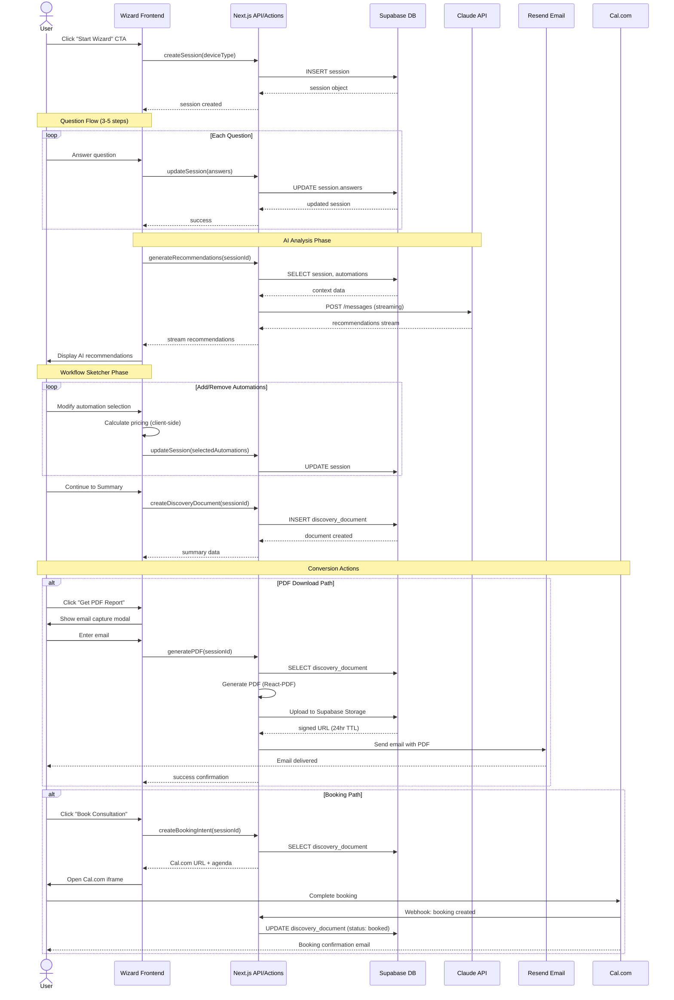

# Core Workflows

This section illustrates critical user journeys through sequence diagrams.

## Complete Wizard Session Flow

```mermaid
sequenceDiagram
    actor User
    participant Frontend as Wizard Frontend
    participant API as Next.js API/Actions
    participant DB as Supabase DB
    participant Claude as Claude API
    participant Resend as Resend Email
    participant Cal as Cal.com

    User->>Frontend: Click "Start Wizard" CTA
    Frontend->>API: createSession(deviceType)
    API->>DB: INSERT session
    DB-->>API: session object
    API-->>Frontend: session created

    Note over User,Frontend: Question Flow (3-5 steps)

    loop Each Question
        User->>Frontend: Answer question
        Frontend->>API: updateSession(answers)
        API->>DB: UPDATE session.answers
        DB-->>API: updated session
        API-->>Frontend: success
    end

    Note over Frontend,Claude: AI Analysis Phase

    Frontend->>API: generateRecommendations(sessionId)
    API->>DB: SELECT session, automations
    DB-->>API: context data
    API->>Claude: POST /messages (streaming)
    Claude-->>API: recommendations stream
    API-->>Frontend: stream recommendations
    Frontend->>User: Display AI recommendations

    Note over User,Frontend: Workflow Sketcher Phase

    loop Add/Remove Automations
        User->>Frontend: Modify automation selection
        Frontend->>Frontend: Calculate pricing (client-side)
        Frontend->>API: updateSession(selectedAutomations)
        API->>DB: UPDATE session
    end

    User->>Frontend: Continue to Summary
    Frontend->>API: createDiscoveryDocument(sessionId)
    API->>DB: INSERT discovery_document
    DB-->>API: document created
    API-->>Frontend: summary data

    Note over User,Cal: Conversion Actions

    alt PDF Download Path
        User->>Frontend: Click "Get PDF Report"
        Frontend->>User: Show email capture modal
        User->>Frontend: Enter email
        Frontend->>API: generatePDF(sessionId)
        API->>DB: SELECT discovery_document
        API->>API: Generate PDF (React-PDF)
        API->>DB: Upload to Supabase Storage
        DB-->>API: signed URL (24hr TTL)
        API->>Resend: Send email with PDF
        Resend-->>User: Email delivered
        API-->>Frontend: success confirmation
    end

    alt Booking Path
        User->>Frontend: Click "Book Consultation"
        Frontend->>API: createBookingIntent(sessionId)
        API->>DB: SELECT discovery_document
        API-->>Frontend: Cal.com URL + agenda
        Frontend->>User: Open Cal.com iframe
        User->>Cal: Complete booking
        Cal->>API: Webhook: booking created
        API->>DB: UPDATE discovery_document (status: booked)
        Cal-->>User: Booking confirmation email
    end
```

---
