# High Level Architecture

## Technical Summary

The AI Discovery Wizard employs a **serverless-first, monolithic fullstack architecture** built on Next.js 14 (App Router) with Supabase as the unified backend platform. The system follows a **progressive enhancement pattern**: a statically-generated landing page transitions to a dynamic, session-driven wizard application that persists state to PostgreSQL and leverages Anthropic's Claude Sonnet for intelligent discovery.

The architecture prioritizes **cost optimization** (targeting $20-100/month at MVP scale), **rapid development velocity** (6-8 week timeline), and **serverless scalability** (auto-scaling from 0 to 100+ concurrent sessions). Frontend components communicate with Next.js Server Actions and API Routes, which orchestrate LLM calls, database operations, and third-party integrations (email, calendar, PDF generation). Session state is persisted to Supabase PostgreSQL with real-time subscriptions enabling auto-save and cross-device handoff.

The **reverse discovery UX pattern** is central to the architecture: users answer 5-8 contextual questions, triggering AI analysis that recommends 3-7 tailored automations displayed in an interactive workflow sketcher with real-time pricing calculations. The experience culminates in PDF report generation and calendar booking integration, converting wizard completions into qualified sales leads.

This architecture achieves PRD goals by: (1) delivering sub-2-second page loads through static generation and code splitting, (2) maintaining <3-second LLM response times via streaming, (3) providing transparent real-time pricing through client-side calculations, (4) ensuring 95%+ uptime via Vercel's edge network, and (5) supporting seamless mobile-desktop handoff through session persistence.

## Platform and Infrastructure Choice

**Platform**: Vercel (Frontend/Edge) + Supabase (Backend/Database)

**Key Services**:

- **Vercel Edge Network**: Static site hosting, serverless functions, automatic scaling, preview deployments
- **Supabase PostgreSQL**: Session storage, discovery documents, automation templates
- **Supabase Edge Functions**: Lightweight serverless compute (Deno runtime) for background tasks
- **Supabase Realtime**: WebSocket subscriptions for session auto-save
- **Cloudflare**: CDN and DDoS protection (free tier)
- **Anthropic API**: Claude Sonnet 3.5 for AI recommendations

**Deployment Host and Regions**:

- **Primary**: Vercel Edge Network (global CDN, 40+ regions)
- **Database**: Supabase US-East-1 (expandable to multi-region post-MVP)
- **Fallback**: Railway or Render for custom backend services if needed

**Decision Rationale**: Vercel + Supabase hits the sweet spot for MVP: generous free tiers ($0-20/month initially), excellent developer experience, automatic scaling, and production-grade reliability (99.9% uptime SLA).

## Repository Structure

**Structure**: Monorepo (single repository, multiple workspaces)

**Monorepo Tool**: npm workspaces (built-in, zero config) or pnpm workspaces (faster, better disk usage)

**Package Organization**:

```
ai-discovery-wizard/
├── apps/
│   └── web/              # Next.js 14 app (frontend + API routes)
├── packages/
│   ├── shared/           # TypeScript types, constants, utilities
│   ├── ui/               # Reusable UI components (shadcn/ui components)
│   └── database/         # Supabase schema, migrations, types
├── docs/                 # Architecture, PRD, runbooks
├── scripts/              # Build, deployment, seed data scripts
└── infrastructure/       # IaC (if needed for custom services)
```

**Rationale**:

- **Monorepo over polyrepo**: Single source of truth, atomic commits, shared dependencies, simpler CI/CD
- **Minimal packages**: Start lean with 3 packages (shared, ui, database), expand only if complexity demands
- **Single Next.js app**: Combines frontend and API routes in one deployable unit, maximizing simplicity

## High Level Architecture Diagram

```mermaid
graph TB
    User[👤 User Browser]
    CDN[Cloudflare CDN]
    Vercel[Vercel Edge Network]
    NextJS[Next.js App<br/>Static + SSR Pages]
    API[Next.js API Routes<br/>Server Actions]
    Claude[Anthropic Claude API]
    Supabase[(Supabase Platform)]
    PSQL[(PostgreSQL Database)]
    Realtime[Realtime WebSocket]
    Edge[Edge Functions]
    Email[Resend Email API]
    Cal[Cal.com Calendar API]
    PDF[PDF Generator<br/>React-PDF]

    User -->|HTTPS| CDN
    CDN -->|Global Edge| Vercel
    Vercel --> NextJS
    NextJS -->|User Actions| API
    API -->|AI Recommendations| Claude
    API -->|CRUD Operations| Supabase
    Supabase --> PSQL
    Supabase --> Realtime
    Supabase --> Edge
    API -->|Generate PDF| PDF
    API -->|Send Email| Email
    API -->|Book Meeting| Cal
    NextJS -.->|Auto-save| Realtime
    Realtime -.->|Session State| PSQL

    style User fill:#e1f5ff
    style Vercel fill:#000
    style Supabase fill:#3ecf8e
    style Claude fill:#d4a574
```



## Architectural Patterns

- **Jamstack Architecture**: Static-first with dynamic enhancements - _Rationale:_ Landing page SEO, instant loads, edge caching while maintaining dynamic wizard interactivity

- **Server Components + Client Islands**: Next.js App Router pattern - _Rationale:_ Minimize client JavaScript, server-render where possible, hydrate only interactive components

- **Backend for Frontend (BFF)**: Next.js API Routes serve as dedicated backend for web app - _Rationale:_ Co-located with frontend, simplified deployment, no CORS complexity, automatic API routing

- **Stateless Serverless Functions**: All API routes are stateless, session state in database - _Rationale:_ Auto-scaling, cost efficiency (pay per request), no server management

- **Event-Driven Background Jobs**: Supabase Edge Functions for async tasks (email, cleanup) - _Rationale:_ Non-blocking user experience, cost-effective async processing

- **Optimistic UI Updates**: Client-side state updates before server confirmation - _Rationale:_ Instant feedback for pricing calculations, add/remove automations feels responsive

- **Repository Pattern**: Data access abstracted through service layer - _Rationale:_ Testability, potential database migration flexibility, cleaner API routes

- **Adapter Pattern**: External integrations wrapped in adapters (email, calendar, LLM) - _Rationale:_ Easy provider swapping, consistent error handling, simplified testing

---
