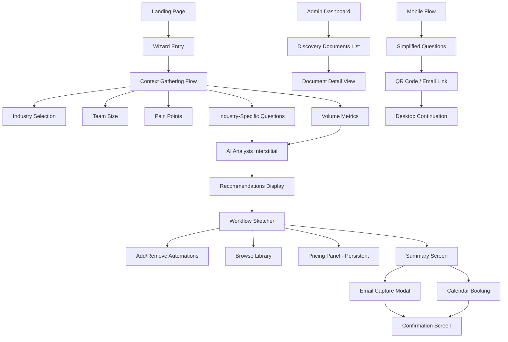
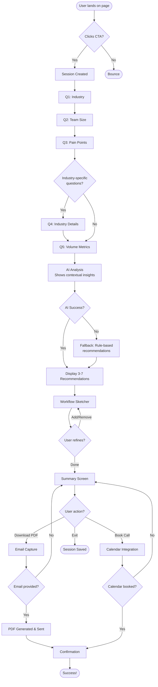
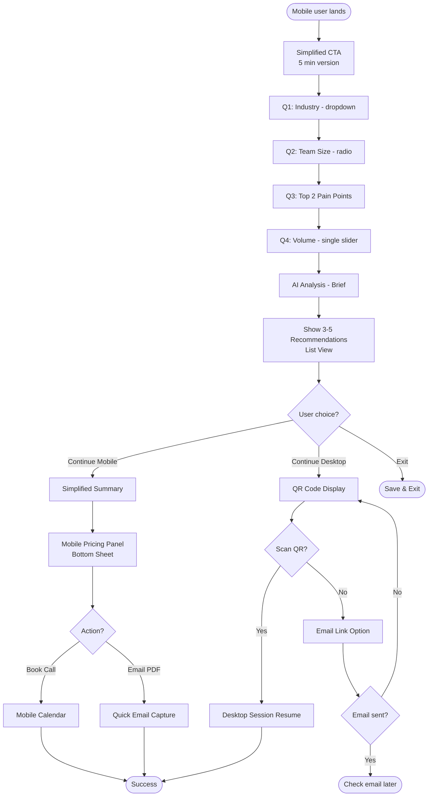

# AI Discovery Wizard UI/UX Specification

## Introduction

This document defines the user experience goals, information architecture, user flows, and visual design specifications for **AI Discovery Wizard**'s user interface. It serves as the foundation for visual design and frontend development, ensuring a cohesive and user-centered experience.

### Overall UX Goals & Principles

#### Target User Personas

**Primary User: Small Business Owner in Professional Services**

- Age: 35-55, owns or manages a professional services firm (legal, healthcare, real estate, consulting)
- Pain points: Manual workflows consuming 15-30% of staff time, limited technical expertise, skeptical of AI hype
- Goals: Understand AI potential quickly, get transparent pricing, minimize risk
- Behavior: Time-constrained, wants self-service discovery, shares decisions with partners/stakeholders

**Secondary User: Operations Manager**

- Manages day-to-day workflows, identifies bottlenecks
- Tech-savvy enough to evaluate automation tools but not a developer
- Seeks concrete ROI metrics and implementation feasibility
- Decision influencer who reports findings to ownership

#### Usability Goals

1. **Speed of Discovery**: New users complete core flow in 10-15 minutes (desktop) or 5 minutes (mobile)
2. **Comprehension**: Users understand automation recommendations and pricing without additional explanation
3. **Confidence Building**: Experience demonstrates AI capability, increasing trust in adoption
4. **Decision Support**: Users can evaluate ROI (cost vs. time saved) and justify decisions to stakeholders
5. **Minimal Friction**: <15% drop-off at any single step, 60%+ overall completion rate

#### Design Principles

1. **Proof Through Experience**: The wizard itself demonstrates AI's intelligence—if discovery is smart and delightful, it validates the technology
2. **Transparent Intelligence**: Show AI reasoning contextually (business calculations, opportunity analysis) rather than hiding behind loading spinners
3. **Progressive Disclosure**: Start simple (basic questions), reveal complexity gradually based on engagement
4. **Immediate Value**: Provide insights early in the flow to maintain momentum and demonstrate worth before asking for commitment
5. **Trust Through Clarity**: No dark patterns, no gatekeeping information, radical transparency in pricing and capabilities

#### Change Log

| Date       | Version | Description                              | Author            |
| ---------- | ------- | ---------------------------------------- | ----------------- |
| 2025-10-15 | 1.0     | Initial front-end specification creation | Sally (UX Expert) |

## Information Architecture (IA)

### Site Map / Screen Inventory

### Navigation Structure

**Primary Navigation:** The wizard uses a linear, sequential flow with no traditional navigation menu during the core experience. Progress bar serves as primary orientation (shows step X of Y with percentage). "Back" button always visible (except on landing page) for step-by-step navigation. No skip-ahead functionality—users must progress sequentially through required steps.

**Secondary Navigation:** During Context Gathering: Back button only. During Workflow Sketcher: Back to recommendations, Edit selections, Continue to summary. Summary Screen: Edit package (returns to sketcher), Download PDF, Book Call. Mobile-specific: "Continue on Desktop" button available throughout flow.

**Breadcrumb Strategy:** Not implemented in traditional sense due to linear wizard flow. Progress indicator acts as implicit breadcrumb: "Question 3 of 5 — 60%" or "Refining Your Package". Screen titles provide context: "Tell us about your business" → "Your AI recommendations" → "Build your package" → "Your automation plan". Mobile uses simplified labels: "Context" → "Recommendations" → "Package" → "Summary".

## User Flows

### Flow 1: Primary Discovery Flow (Desktop)

**User Goal:** Discover relevant AI automations with transparent pricing in 10-15 minutes

**Entry Points:** Landing page CTA: "Check if AI can be useful for me", direct link from marketing campaigns or referrals

**Success Criteria:** User completes all context questions, AI generates relevant recommendations, user views pricing and understands ROI, user either downloads PDF or books consultation

#### Flow Diagram

#### Edge Cases & Error Handling:

- **Session creation fails**: Display error message with retry button, log error to monitoring
- **User refreshes during flow**: Auto-save preserves state, user returns to current step
- **User clicks back button excessively**: Allow navigation to any previous step, preserve all answers
- **AI analysis timeout (>10s)**: Fall back to rule-based recommendations, log for investigation
- **No relevant automations found**: Show message "Based on your answers, let's explore custom solutions" with manual contact option
- **Pricing calculation fails**: Show automations without pricing, display "Contact us for pricing" CTA
- **PDF generation fails**: Offer retry, then fallback to "We'll email it within 24 hours" with manual follow-up
- **Email delivery fails**: Show download link for immediate PDF access, log delivery failure for retry
- **Calendar service unavailable**: Fall back to contact form: "Schedule via email instead"
- **Network disconnection mid-flow**: Show "Connection lost" message, auto-retry when back online, preserve session state

**Notes:** The flow prioritizes completion over perfection—every failure has a graceful fallback. Auto-save after every interaction ensures no data loss. User can exit and return anytime within 7 days.

### Flow 2: Mobile Lite Flow (5-minute version)

**User Goal:** Quick discovery on mobile with option to continue on desktop

**Entry Points:** Landing page on mobile device (<768px viewport), mobile-optimized ad campaigns

**Success Criteria:** User completes streamlined questions in ~5 minutes, user receives basic automation recommendations, user either continues on desktop OR books call directly from mobile

#### Flow Diagram

#### Edge Cases & Error Handling:

- **QR code won't scan**: Offer "Email me the link" button immediately
- **Small screen readability**: Test minimum viewport 375px (iPhone SE), ensure 44px touch targets
- **Slow mobile connection**: Show skeleton screens instead of blank loading, reduce image sizes
- **User tries to add many automations on mobile**: Suggest "Continue on desktop for full customization"
- **Calendar booking on mobile difficult**: Offer "Call me instead" with phone number capture
- **User abandons QR flow**: Auto-send email link after 30 seconds with "Still want to continue?"

**Notes:** Mobile flow is optimized for speed and minimal input. Heavy interactions (workflow sketcher customization, detailed pricing breakdown) deferred to desktop. Session handoff is frictionless—no account creation required.

## Wireframes & Mockups

**Primary Design Files:** To be determined - recommend Figma for collaborative design, prototyping, and developer handoff. Alternative: Sketch or Adobe XD.

### Key Screen Layouts

#### Landing Page

**Purpose:** Convert visitors into wizard participants by clearly communicating value proposition and time commitment

**Key Elements:**

- Hero section with headline: "Discover what AI can do for your business in 10 minutes—with transparent pricing"
- Time commitment badge (prominently displayed): "⏱️ 10-15 min on desktop, 5 min on mobile"
- Primary CTA button: "Check if AI can be useful for me" (large, high-contrast, centered above fold)
- Social proof elements: "100+ businesses discovered automation opportunities" or testimonial quotes
- Three benefit bullets: "✓ AI suggests relevant automations", "✓ See transparent pricing instantly", "✓ Get shareable PDF report"
- Trust indicators: "No credit card required", "No commitment", privacy badge
- Clean, professional aesthetic: generous whitespace, modern typography, professional services-appropriate imagery (not tech-heavy)

**Interaction Notes:** CTA button has hover state with subtle animation (lift + shadow). Scroll indicator suggests "Learn more" content below fold. Mobile version reduces hero text, maintains large CTA button (44px minimum touch target). Fast load critical: hero image optimized <100KB, above-fold content prioritized.

**Design File Reference:** [To be created in Figma: Landing-Page-Desktop-v1, Landing-Page-Mobile-v1]

#### Question Flow (Context Gathering)

**Purpose:** Gather business context through conversational, adaptive questions without feeling like interrogation

**Key Elements:**

- Progress bar at top: "Question 3 of 5 — 60%" with visual fill
- Question title (large, friendly): "What industry are you in?"
- Form control appropriate to question type: Dropdown for industry, radio buttons for team size, checkboxes for multi-select pain points
- Contextual help text below question: Light gray, explains why we're asking
- Back button (subtle, top-left): "← Back"
- Next button (prominent, bottom-right): "Continue →" (disabled until answer selected)
- Auto-save indicator (subtle, top-right): "Saved" with checkmark icon
- Visual breathing room: Single question per screen, minimal distractions

**Interaction Notes:** Next button enables with animation when valid answer selected. Progress bar animates smoothly on forward/back navigation. Form controls have clear focus states (keyboard navigation). Mobile: Larger touch targets, simplified layouts, minimal scrolling per screen. Adaptive branching invisible to user: Progress bar adjusts dynamically without confusion.

**Design File Reference:** [To be created: Question-Flow-Industry, Question-Flow-TeamSize, Question-Flow-PainPoints, Question-Flow-VolumeMetrics]

#### AI Analysis Interstitial

**Purpose:** Transform loading time into value demonstration by showing contextual business insights

**Key Elements:**

- Animated icon: Abstract AI visual (not cliché robot/brain), subtle movement
- Primary message: "Analyzing your workflow opportunities..."
- **Contextual insight card** (this is the key differentiator): Shows real calculation based on user input
  - Example: "5 paralegals × 2hrs/day document review = 50hrs/week automation opportunity"
  - Example: "Real estate firms with 50 closings/month typically save 20-25 hours with contract automation"
- Progress indicator: Subtle spinner or animated dots (2-3 seconds typical duration)
- Branded color scheme: Matches overall aesthetic

**Interaction Notes:** Insight changes if analysis takes >3 seconds (show 2-3 rotating insights). No generic "Please wait" messaging—every message is contextually relevant. Smooth transition to recommendations screen (fade/slide animation). Mobile: Simplified visual, same contextual messaging.

**Design File Reference:** [To be created: AI-Analysis-Interstitial-Desktop, AI-Analysis-Interstitial-Mobile]

#### Workflow Sketcher (The Signature Experience)

**Purpose:** Enable intuitive automation package customization with real-time pricing feedback—the "next-level familiar" interaction

**Key Elements:**

- **Main Canvas** (left 60-70% desktop):
  - 3-7 automation cards arranged in organized grid (2-3 columns)
  - Each card: Icon, title, 2-sentence description, time savings badge ("Saves ~15hrs/month"), cost contribution ("$450/mo")
  - Remove button (X icon, top-right corner of each card)
  - Visual hierarchy: Title and time savings most prominent
  - Empty state message if all cards removed: "Add automations from library below"

- **Persistent Pricing Panel** (right 30-40% desktop, sticky):
  - Total monthly cost: "$2,450/month" (large, bold)
  - Total time savings: "Saves 42 hours/month"
  - ROI metric: "$58/hour saved — less than hiring"
  - Automations count: "5 automations selected"
  - "View Detailed Breakdown" button (expands to show per-automation costs)
  - "Continue to Summary" CTA button (prominent, primary color)

- **Automation Library** (below sketcher canvas):
  - Section header: "Browse More Automations"
  - Category tabs: All, Document Processing, Communication, Data Analysis, Administrative
  - Library cards (similar to sketcher cards but with "Add +" button instead of remove)
  - Search/filter controls

**Interaction Notes:** Card add/remove has smooth animation (fade in/out, not jarring). Pricing panel updates within 500ms of changes (no full page reload). Hover states on cards show additional detail or dim/brighten. Drag-to-reorder considered but deferred to post-MVP (adds complexity without clear UX benefit). Mobile: Cards display as list (single column), pricing panel becomes bottom sheet (swipe up to expand), library scrollable with category filters.

**Design File Reference:** [To be created: Workflow-Sketcher-Desktop-Full, Workflow-Sketcher-Mobile-Compact, Pricing-Panel-Expanded, Automation-Library]

#### Summary Screen

**Purpose:** Professional, boardroom-ready output that user can confidently share with stakeholders

**Key Elements:**

- Document-style layout (centered, max-width ~900px)
- Section 1: "Your Business Context" - Industry, team size, pain points formatted clearly
- Section 2: "Recommended Automations" - List with icons, descriptions, time savings
- Section 3: "Time Savings Analysis" - Visual breakdown (table or simple chart)
- Section 4: "Investment Summary" - Total cost, cost per hour saved, ROI calculation
- Call-out box: Key insights ("Your 5-person legal team could save 42 hours/month...")
- Two prominent CTAs side-by-side:
  - "Download PDF Report" (primary button)
  - "Book a Consultation" (secondary button with calendar icon)
- "Edit Package" link (subtle, top-right): Returns to workflow sketcher
- Timestamp: "Report generated: October 15, 2025"

**Interaction Notes:** Print-friendly CSS: Clean layout when printing or generating PDF. Scroll to top on load (user sees full summary from beginning). CTA buttons have loading states when clicked (PDF generation, calendar loading). Mobile: Same content, single-column layout, CTAs stacked vertically (full-width buttons).

**Design File Reference:** [To be created: Summary-Screen-Desktop, Summary-Screen-Mobile, Summary-Print-View]

#### Email Capture Modal

**Purpose:** Value-first email capture that feels like mutual exchange, not data extraction

**Key Elements:**

- Modal overlay (subtle background dim, not jarring black)
- Modal header: "Get Your Personalized Automation Plan"
- Value proposition: "Receive your shareable PDF report via email—perfect for discussing with partners and stakeholders"
- Email input field (large, clear label: "Email address")
- Privacy assurance text: "We'll only use your email to send this report. No spam, unsubscribe anytime."
- Optional checkbox: "Yes, send me occasional automation insights" (opt-in for newsletter)
- Two buttons: "Send Report" (primary) and "Cancel" (secondary/text link)
- Success state (after submission): Checkmark icon, "Sent! Check your inbox in the next few minutes."

**Interaction Notes:** Email validation on blur (real-time feedback for invalid format). Send button disabled until valid email entered. Modal dismisses on "Cancel" or clicking outside (returns to summary). Loading state on "Send Report" (spinner + "Generating PDF..."). Mobile: Modal adapts to full-screen on small viewports (easier input on mobile keyboards).

**Design File Reference:** [To be created: Email-Capture-Modal, Email-Capture-Success]

## Component Library / Design System

**Design System Approach:** Leverage existing design system primitives rather than building from scratch. Recommend **shadcn/ui** as the foundation—provides accessible, customizable React components built on Radix UI primitives, fully compatible with Tailwind CSS. This approach balances customization needs with development velocity for MVP timeline.

### Core Components

#### Button

**Purpose:** Primary interaction element for CTAs, form submissions, and navigation

**Variants:** Primary (high-contrast, bold for CTA actions), Secondary (lower contrast, outlined for alternative actions), Ghost (minimal styling for tertiary actions), Destructive (red/warning color for removal actions)

**States:** Default, Hover, Active, Disabled, Loading (with spinner)

**Usage Guidelines:** Maximum one primary button per screen/section. Large touch targets: 44px minimum height on mobile, 40px desktop. Loading state disables button and shows spinner while maintaining width. Icons: leading for clear metaphors (calendar, download), trailing for forward navigation. Accessible with clear focus ring and aria-label when icon-only.

#### Card (Automation Card)

**Purpose:** Display automation options in workflow sketcher and library

**Variants:** Sketcher Card (includes remove button, selected state), Library Card (includes add button, browsable state), Recommendation Card (initial AI suggestions, highlighted state)

**States:** Default, Hover (subtle lift/shadow), Selected (border highlight), Disabled

**Usage Guidelines:** Consistent card anatomy: Icon top-left, title, description, time savings badge bottom-left, cost bottom-right, action button top-right. Visual hierarchy: Title 18px bold, description 14px regular, badges 12px semibold. Hover animation: Subtle scale (1.02x) + shadow increase, 200ms ease-out. Mobile: Remove hover states, increase padding for thumb targets. Empty state shows dashed border card with "Browse library" message.

#### Modal / Dialog

**Purpose:** Email capture, confirmations, detailed breakdowns

**Variants:** Standard Modal (center-aligned, max-width 500px for email capture), Large Modal (max-width 800px for pricing breakdown), Full-screen Mobile (slides up from bottom on <768px)

**States:** Open, Closing (fade-out animation), Focus-trapped (keyboard navigation contained)

**Usage Guidelines:** Semi-transparent backdrop (rgba(0,0,0,0.5)), dismissible by clicking outside or ESC key. Auto-focus first input field on open, trap tab navigation within modal. Close button always visible top-right (X icon). Animations: Fade in backdrop (150ms), scale up modal (200ms ease-out). Accessibility: aria-modal="true", role="dialog", focus restoration on close.

#### Progress Bar

**Purpose:** Show wizard completion percentage

**Variants:** Linear (horizontal bar with fill percentage), Stepped (show discrete steps like "Step 3 of 5")

**States:** Active (current step), Completed (previous steps), Upcoming (future steps)

**Usage Guidelines:** Always visible with sticky top position during wizard flow. Smooth transition animation when progress changes (300ms ease). Text label shows both step count and percentage ("Question 3 of 5 — 60%"). Use primary brand color for fill, light gray for unfilled. Mobile: Reduce text size while maintaining visual prominence.

#### Form Controls

**Purpose:** Capture user input in question flow

**Variants:** Select/Dropdown (industry selection, searchable for long lists), Radio Button Group (team size, mutually exclusive options), Checkbox Group (pain points, multi-select), Slider (volume metrics, numerical range input), Text Input (email capture, open-ended questions)

**States:** Default, Focus, Filled, Error (with validation message), Disabled

**Usage Guidelines:** Clear labels always above/beside input, not placeholder-only. Prominent focus indicators with high contrast border/ring. Validation on blur for performance with inline error messages below field. Error states include red border, error icon, and clear message. Mobile: Large touch targets, appropriate input types (email keyboard, number pad).

#### Pricing Panel

**Purpose:** Persistent sidebar/bottom-sheet showing real-time pricing

**Variants:** Desktop Sidebar (fixed right column, 30-40% width), Mobile Bottom Sheet (collapsible, swipe-up to expand), Expanded View (modal showing detailed per-automation breakdown)

**States:** Collapsed (mobile), Expanded, Loading (during calculation)

**Usage Guidelines:** Sticky positioning remains visible during scroll on desktop. Update animation provides subtle pulse or highlight when values change. Hierarchy: Total cost most prominent (32px bold), secondary metrics 16-18px. CTA button always visible at bottom of panel ("Continue to Summary"). Loading state dims previous values and shows subtle spinner (<500ms typically).

## Branding & Style Guide

### Visual Identity

**Brand Guidelines:** To be created. Recommend establishing brand identity that balances professionalism (appeals to business owners) with innovation (demonstrates AI capability). Inspiration sources: Linear (polish, attention to detail), Stripe (clarity, trustworthy), Notion (approachable, not intimidating). Avoid overly technical/engineer-focused aesthetics.

### Color Palette

| Color Type | Hex Code                                                      | Usage                                                            |
| ---------- | ------------------------------------------------------------- | ---------------------------------------------------------------- |
| Primary    | #3B82F6                                                       | Primary buttons, progress bars, links, brand accents             |
| Secondary  | #8B5CF6                                                       | Secondary accents, highlights, AI-related elements               |
| Accent     | #10B981                                                       | Success states, positive metrics (time saved), growth indicators |
| Success    | #22C55E                                                       | Positive feedback, confirmations, completed states               |
| Warning    | #F59E0B                                                       | Cautions, important notices, attention-needed states             |
| Error      | #EF4444                                                       | Errors, destructive actions, validation failures                 |
| Neutral    | #F9FAFB, #F3F4F6, #E5E7EB, #9CA3AF, #6B7280, #374151, #1F2937 | Text hierarchy, borders, backgrounds (light to dark scale)       |

### Typography

#### Font Families

- **Primary:** Inter (sans-serif) - Excellent readability at all sizes, modern, professional, optimized for screens
- **Secondary:** System font stack fallback: -apple-system, BlinkMacSystemFont, "Segoe UI", Roboto, "Helvetica Neue", Arial, sans-serif
- **Monospace:** JetBrains Mono - For code snippets, technical details, token counts (if displayed)

#### Type Scale

| Element | Size            | Weight       | Line Height |
| ------- | --------------- | ------------ | ----------- |
| H1      | 48px / 3rem     | 700 Bold     | 1.2 / 58px  |
| H2      | 36px / 2.25rem  | 700 Bold     | 1.3 / 47px  |
| H3      | 24px / 1.5rem   | 600 Semibold | 1.4 / 34px  |
| Body    | 16px / 1rem     | 400 Regular  | 1.6 / 26px  |
| Small   | 14px / 0.875rem | 400 Regular  | 1.5 / 21px  |

**Additional Specifications:** Body Large (18px, 400 Regular, 1.6 line-height) for hero copy and important callouts. Label (14px, 500 Medium, 1.4 line-height) for form labels and navigation. Caption (12px, 400 Regular, 1.5 line-height) for helper text and metadata. Mobile adjustments: H1 reduces to 36px, H2 to 28px on <768px. Body text maintains 16px minimum for readability.

### Iconography

**Icon Library:** Lucide Icons (https://lucide.dev) - Open source, consistent style, extensive library, React components available

**Usage Guidelines:** Icon sizing: 16px (inline with text), 20px (standard UI), 24px (prominent actions), 32px+ (feature illustrations). Stroke width 2px standard. Color inherits from parent text for consistency. Always include text labels for primary actions. Automation category icons: Document (file-text), Communication (message-square), Data Analysis (bar-chart), Administrative (settings). Action icons: Remove (x), Add (plus), Calendar (calendar), Download (download), Edit (edit-2), Back (arrow-left), Forward (arrow-right). All meaningful icons include aria-label; decorative icons have aria-hidden="true".

### Spacing & Layout

**Grid System:** 12-column grid on desktop (1024px+), 6-column on tablet (768-1023px), single column on mobile (<768px)

**Spacing Scale:** Based on Tailwind's default scale (4px base unit). xs: 4px (tight spacing, icon-text gaps), sm: 8px (related elements), md: 16px (standard component padding), lg: 24px (section spacing), xl: 32px (component gaps), 2xl: 48px (section separators), 3xl: 64px (major section breaks).

**Container Max-Width:** Landing page content: 1280px, Wizard content: 1024px, Summary/document view: 900px (reading-optimized)

**Border Radius:** sm: 4px (badges, tags), md: 8px (buttons, inputs, cards), lg: 12px (modals, panels), xl: 16px (hero sections)

**Shadows:** sm: `0 1px 2px rgba(0, 0, 0, 0.05)` (subtle elevation), md: `0 4px 6px rgba(0, 0, 0, 0.07)` (standard cards), lg: `0 10px 15px rgba(0, 0, 0, 0.1)` (modals, pricing panel), xl: `0 20px 25px rgba(0, 0, 0, 0.15)` (maximum elevation)

## Accessibility Requirements

### Compliance Target

**Standard:** WCAG 2.1 Level AA - Target standard for MVP to ensure usability for users with disabilities and meet common legal/enterprise requirements. Full AAA compliance deferred to post-MVP unless specific client needs emerge.

### Key Requirements

**Visual:**

- Color contrast ratios: 4.5:1 minimum for normal text (16px and below), 3:1 for large text (18px+ or 14px+ bold). All text/background combinations tested using contrast checker tools. Error states never rely on color alone (include icons + text).
- Focus indicators: All interactive elements (buttons, links, form inputs, cards) have visible focus rings with 3:1 contrast against background. Focus order follows logical reading order (top to bottom, left to right).
- Text sizing: Base font size 16px minimum (never below 14px). User can zoom to 200% without loss of content or functionality (responsive design supports zoom). No fixed height containers that truncate text.

**Interaction:**

- Keyboard navigation: All functionality accessible via keyboard alone (Tab, Enter, Space, Escape, Arrow keys). No keyboard traps (user can always escape modals/components). Skip links allow bypassing repetitive navigation. Focus visible at all times during keyboard navigation.
- Screen reader support: Semantic HTML structure (nav, main, section, article elements). ARIA labels for icon-only buttons and dynamic content. ARIA live regions announce dynamic changes (pricing updates, loading states). Proper heading hierarchy (single h1, sequential h2-h6).
- Touch targets: Minimum 44×44px touch target size on mobile for all interactive elements (buttons, links, checkboxes). Adequate spacing between adjacent touch targets (8px minimum).

**Content:**

- Alternative text: All informational images include descriptive alt text. Decorative images have empty alt attribute (alt="") or aria-hidden="true". Icons conveying meaning include accessible labels.
- Heading structure: Proper semantic heading hierarchy for page structure. Headings describe section content. No skipped heading levels (h2 doesn't jump to h4).
- Form labels: Every form input has associated label element (for/id relationship or aria-labelledby). Error messages associated with fields via aria-describedby. Required fields indicated with both visual (\*) and aria-required="true".

### Testing Strategy

**Automated Testing:** Integrate Axe DevTools or Lighthouse accessibility audits in CI/CD pipeline. Run automated tests on every build to catch regressions. Target: Zero critical/serious violations before deployment.

**Manual Testing:** Keyboard-only navigation through full wizard flow (no mouse). Screen reader testing with NVDA (Windows), VoiceOver (Mac/iOS), TalkBack (Android) on key flows. Verify usability at 200% browser zoom. Test with color blindness simulation tools (Deuteranopia, Protanopia, Tritanopia).

**Beta Testing:** Include users with disabilities in beta testing cohort. Gather feedback on assistive technology compatibility. Prioritize fixes for barriers identified by real users.

**Testing Frequency:** Automated tests run on every PR/deployment. Manual keyboard/screen reader testing weekly during development with full audit before launch. User testing during beta phase (Epic 5).

## Responsiveness Strategy

### Breakpoints

| Breakpoint | Min Width | Max Width | Target Devices                                         |
| ---------- | --------- | --------- | ------------------------------------------------------ |
| Mobile     | 0px       | 767px     | iPhone SE (375px), standard smartphones up to phablets |
| Tablet     | 768px     | 1023px    | iPad (768px), iPad Pro (834px), Android tablets        |
| Desktop    | 1024px    | 1439px    | Standard laptops, small desktop monitors               |
| Wide       | 1440px    | -         | Large desktop monitors, ultrawide displays             |

### Adaptation Patterns

**Layout Changes:** Mobile (0-767px) uses single-column layout throughout with stacked workflow sketcher cards and bottom sheet pricing panel. Tablet (768-1023px) employs hybrid layout with 2-column card grid and collapsible pricing sidebar. Desktop (1024px+) features full multi-column layouts with 3-column card grid and persistent pricing sidebar. Wide (1440px+) centers content with max-width constraints (1280px) and slightly scaled typography.

**Navigation Changes:** Mobile displays back button in header (top-left) with next button in fixed bottom bar, sticky progress bar at top, minimal chrome. Tablet similar to mobile with more spacing, centered buttons (max 400px width). Desktop shows inline back/next buttons within content area, persistent progress bar, visible secondary actions without expanding menus.

**Content Priority:** Mobile-first approach never hides critical information, only collapses secondary details (help text behind tap-to-expand). Desktop shows additional context inline with more automations visible in library (12 vs 6 on mobile). Images optimized per breakpoint via srcset: 375px (mobile), 768px (tablet), 1280px (desktop), 1920px (wide). Time savings shown as simple list on mobile, enhanced with charts/graphs on desktop.

**Interaction Changes:** Touch optimization for mobile/tablet uses 44px minimum touch targets, removes non-functional hover states, enables swipe gestures for bottom sheet. Mouse optimization for desktop includes hover states with additional info, cursor changes, and tooltips. Keyboard navigation remains consistent across all breakpoints. Mobile shows simpler loading skeletons while desktop can display richer animations.

## Animation & Micro-interactions

### Motion Principles

**Purpose-Driven Motion**: Every animation serves a functional purpose—guide attention, provide feedback, indicate relationships, or smooth transitions. Never animate purely for decoration. Animations should feel snappy and responsive, not slow or overly elaborate.

**Performance First**: All animations must maintain 60fps. Use CSS transforms (translate, scale, rotate) and opacity for GPU acceleration. Avoid animating properties that trigger layout recalculation (width, height, top, left). Test on lower-end mobile devices to ensure smooth performance.

**Respect User Preferences**: Honor `prefers-reduced-motion` media query. Users who enable reduced motion see instant transitions (no animation) or subtle fades only. Never use motion that could trigger vestibular disorders (parallax, excessive rotation).

**Consistent Timing**: Use standardized durations and easing functions across the application for cohesive feel. Fast interactions (<200ms) feel responsive. Medium transitions (200-400ms) smooth state changes. Slow animations (>400ms) only for page-level transitions or complex choreography.

**Subtle and Refined**: Follow Linear's approach—animations are present but understated. Users should feel polish without consciously noticing individual animations. Avoid bouncy, elastic, or exaggerated effects (not appropriate for professional services audience).

### Key Animations

- **Button Click**: Scale down to 0.95 on active state (Duration: 100ms, Easing: ease-out), return to 1.0 on release (Duration: 150ms, Easing: ease-out). Loading state: spinner fades in after 300ms delay.

- **Card Add/Remove**: Card fades in with scale from 0.9 to 1.0 on add (Duration: 200ms, Easing: ease-out). Card fades out to 0.8 opacity while scaling to 0.95 on remove (Duration: 150ms, Easing: ease-in). Surrounding cards shift position smoothly (Duration: 300ms, Easing: ease-in-out).

- **Modal Open/Close**: Backdrop fades in to rgba(0,0,0,0.5) (Duration: 150ms, Easing: ease-out). Modal scales from 0.95 to 1.0 while fading in (Duration: 200ms, Easing: ease-out). Close reverses with modal scaling to 0.95 (Duration: 150ms, Easing: ease-in).

- **Progress Bar Fill**: Animated on forward navigation (Duration: 300ms, Easing: ease-out). No animation on back navigation for instant feedback.

- **Pricing Update**: New number fades in from below while old fades out above (Duration: 250ms, Easing: ease-in-out). Subtle background pulse with highlight color at 0.1 opacity (Duration: 400ms, Easing: ease-out).

- **Page Transition**: Outgoing content fades out (Duration: 150ms, Easing: ease-in). Incoming content fades in with slight upward translate from y: 16px to 0 (Duration: 250ms, Easing: ease-out).

- **Form Focus**: Input border color transitions (Duration: 150ms, Easing: ease-out). Focus ring scales from 0 to full size (Duration: 100ms, Easing: ease-out).

- **Skeleton Loading**: Subtle shimmer effect with gradient moving left-to-right (Duration: 1500ms, Easing: linear, infinite).

- **Toast/Notification**: Slides in from top with fade (Duration: 200ms, Easing: ease-out). Auto-dismiss after 5 seconds with fade out (Duration: 150ms, Easing: ease-in).

- **Hover Effects**: Subtle lift on cards with translateY: -2px and shadow increase (Duration: 200ms, Easing: ease-out). Buttons show slight background color shift (Duration: 150ms, Easing: ease-out).

- **Contextual Insight Display**: Insight cards fade in with slight scale from 0.98 to 1.0 (Duration: 300ms, Easing: ease-out), staggered 100ms delay if multiple cards.

## Performance Considerations

### Performance Goals

- **Page Load:** Initial landing page load completes in <2 seconds on desktop broadband, <3 seconds on mobile 4G
- **Interaction Response:** User interactions (button clicks, form submissions) respond within 300ms, AI-powered responses within 3 seconds
- **Animation FPS:** All animations maintain 60fps without frame drops on target devices (iPhone 12+, mid-range Android, modern desktop browsers)

### Design Strategies

**Bundle Size Optimization**: Implement code splitting to load only necessary JavaScript for current wizard step. Use dynamic imports for heavy components (PDF generator, calendar widget). Target initial bundle <500KB gzipped. Lazy load images and non-critical assets below fold.

**Image Optimization**: Serve responsive images via srcset with appropriate sizes for each breakpoint. Use modern formats (WebP with JPEG fallback). Compress images to balance quality and file size. Lazy load images below fold and in automation library.

**CSS Strategy**: Use Tailwind's purge/JIT mode to eliminate unused styles. Critical CSS inlined in HTML head for above-fold content. Non-critical CSS loaded asynchronously. Minimize CSS animations complexity to maintain 60fps.

**Font Loading**: Use font-display: swap for Inter font to prevent invisible text during load. Preload critical font weights (400, 600, 700). Consider system font stack fallback for instant text rendering.

**API Optimization**: Implement request debouncing for pricing calculations during rapid user changes. Cache automation templates and static data in browser. Use HTTP/2 multiplexing for parallel resource loading. Implement proper cache headers for static assets.

**Rendering Strategy**: Use skeleton screens instead of blank loading states (perceived performance). Implement progressive rendering—show content as it loads rather than waiting for everything. Avoid layout shifts (reserve space for dynamic content). Use CSS containment for complex components.

**Third-Party Scripts**: Defer non-critical third-party scripts (analytics, chat widgets). Use async loading for scripts that don't block rendering. Minimize third-party dependencies to reduce performance overhead.

## Next Steps

### Immediate Actions

1. **Create Visual Design Mockups**: Translate wireframe specifications into high-fidelity designs in Figma (Landing Page, Question Flow, Workflow Sketcher, Summary Screen)
2. **Component Library Setup**: Initialize shadcn/ui in project, configure Tailwind theme with brand colors and typography, create custom Automation Card component
3. **Responsive Prototypes**: Build interactive prototypes for mobile and desktop workflows to validate user flows and interactions before development
4. **Accessibility Audit Plan**: Set up Axe DevTools in CI/CD pipeline, create manual testing checklist for keyboard navigation and screen readers
5. **Design System Documentation**: Document component usage guidelines, accessibility requirements, and responsive behaviors for development team
6. **Design Review with Stakeholders**: Present UX specifications and visual designs to project stakeholders for approval before development begins

### Design Handoff Checklist

- [x] All user flows documented
- [x] Component inventory complete
- [x] Accessibility requirements defined
- [x] Responsive strategy clear
- [x] Brand guidelines incorporated
- [x] Performance goals established

## Checklist Results

This front-end specification provides comprehensive UX and design guidance for the AI Discovery Wizard, covering all major screens, interaction patterns, and technical requirements. The specification balances the "next-level familiar" vision with practical MVP constraints, ensuring a polished, accessible, and performant user experience.

**Key Deliverables:**

- Target user personas and usability goals defined
- Complete information architecture with site map and navigation strategy
- Detailed user flows for desktop and mobile with error handling
- Wireframe specifications for 6 key screens
- Component library approach with shadcn/ui + Tailwind CSS
- Complete branding and style guide (colors, typography, spacing, iconography)
- WCAG 2.1 Level AA accessibility requirements
- Responsive strategy with 4 breakpoints and adaptation patterns
- Animation specifications with performance-first approach
- Performance goals and optimization strategies

**Next Phase:** Hand off to System Architect for technical implementation planning, then to Development team (James) for implementation following user stories in PRD.
