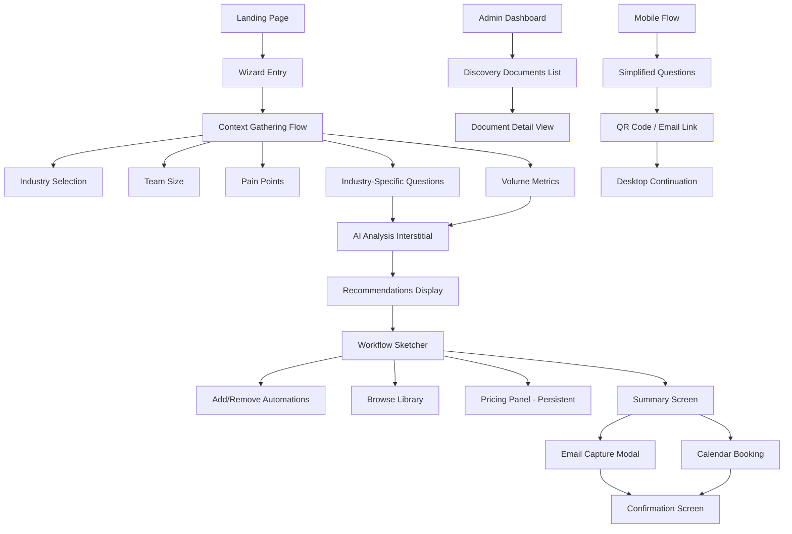

# Information Architecture (IA)

## Site Map / Screen Inventory

## Navigation Structure

**Primary Navigation:** The wizard uses a linear, sequential flow with no traditional navigation menu during the core experience. Progress bar serves as primary orientation (shows step X of Y with percentage). "Back" button always visible (except on landing page) for step-by-step navigation. No skip-ahead functionality—users must progress sequentially through required steps.

**Secondary Navigation:** During Context Gathering: Back button only. During Workflow Sketcher: Back to recommendations, Edit selections, Continue to summary. Summary Screen: Edit package (returns to sketcher), Download PDF, Book Call. Mobile-specific: "Continue on Desktop" button available throughout flow.

**Breadcrumb Strategy:** Not implemented in traditional sense due to linear wizard flow. Progress indicator acts as implicit breadcrumb: "Question 3 of 5 — 60%" or "Refining Your Package". Screen titles provide context: "Tell us about your business" → "Your AI recommendations" → "Build your package" → "Your automation plan". Mobile uses simplified labels: "Context" → "Recommendations" → "Package" → "Summary".
