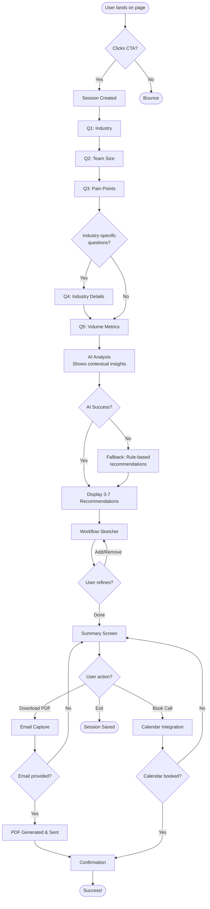
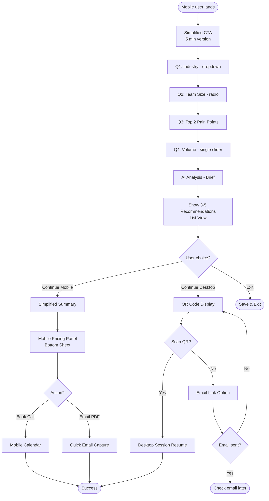

# User Flows

## Flow 1: Primary Discovery Flow (Desktop)

**User Goal:** Discover relevant AI automations with transparent pricing in 10-15 minutes

**Entry Points:** Landing page CTA: "Check if AI can be useful for me", direct link from marketing campaigns or referrals

**Success Criteria:** User completes all context questions, AI generates relevant recommendations, user views pricing and understands ROI, user either downloads PDF or books consultation

### Flow Diagram

### Edge Cases & Error Handling:

- **Session creation fails**: Display error message with retry button, log error to monitoring
- **User refreshes during flow**: Auto-save preserves state, user returns to current step
- **User clicks back button excessively**: Allow navigation to any previous step, preserve all answers
- **AI analysis timeout (>10s)**: Fall back to rule-based recommendations, log for investigation
- **No relevant automations found**: Show message "Based on your answers, let's explore custom solutions" with manual contact option
- **Pricing calculation fails**: Show automations without pricing, display "Contact us for pricing" CTA
- **PDF generation fails**: Offer retry, then fallback to "We'll email it within 24 hours" with manual follow-up
- **Email delivery fails**: Show download link for immediate PDF access, log delivery failure for retry
- **Calendar service unavailable**: Fall back to contact form: "Schedule via email instead"
- **Network disconnection mid-flow**: Show "Connection lost" message, auto-retry when back online, preserve session state

**Notes:** The flow prioritizes completion over perfection—every failure has a graceful fallback. Auto-save after every interaction ensures no data loss. User can exit and return anytime within 7 days.

## Flow 2: Mobile Lite Flow (5-minute version)

**User Goal:** Quick discovery on mobile with option to continue on desktop

**Entry Points:** Landing page on mobile device (<768px viewport), mobile-optimized ad campaigns

**Success Criteria:** User completes streamlined questions in ~5 minutes, user receives basic automation recommendations, user either continues on desktop OR books call directly from mobile

### Flow Diagram

### Edge Cases & Error Handling:

- **QR code won't scan**: Offer "Email me the link" button immediately
- **Small screen readability**: Test minimum viewport 375px (iPhone SE), ensure 44px touch targets
- **Slow mobile connection**: Show skeleton screens instead of blank loading, reduce image sizes
- **User tries to add many automations on mobile**: Suggest "Continue on desktop for full customization"
- **Calendar booking on mobile difficult**: Offer "Call me instead" with phone number capture
- **User abandons QR flow**: Auto-send email link after 30 seconds with "Still want to continue?"

**Notes:** Mobile flow is optimized for speed and minimal input. Heavy interactions (workflow sketcher customization, detailed pricing breakdown) deferred to desktop. Session handoff is frictionless—no account creation required.
